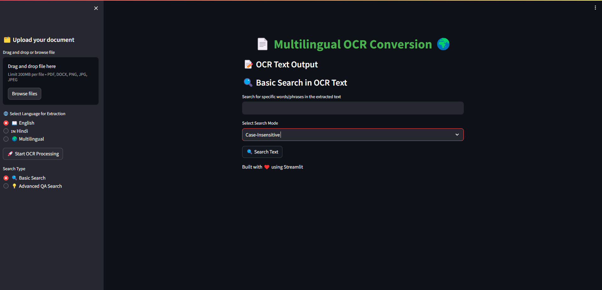
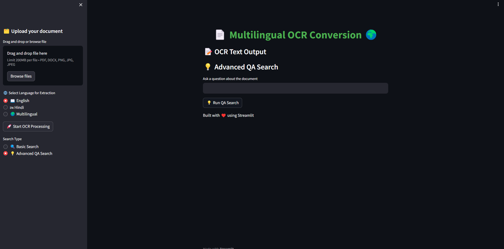
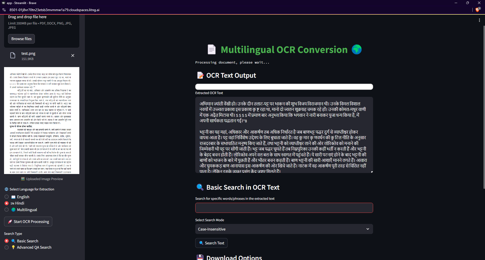

# Multilingual OCR Conversion



## Introduction

This project provides a user-friendly interface for performing Optical Character Recognition (OCR) on multilingual documents. It allows users to upload documents in different formats such as PDF, DOCX, PNG, JPG, and JPEG, and extract text in multiple languages, including English, Hindi, and multilingual. Additionally, it includes basic search and advanced QA search functionalities for finding specific information within the extracted text.

---

## Features

- **Document Upload**: Supports PDF, DOCX, PNG, JPG, and JPEG formats for upload.
- **Multilingual OCR**: Extracts text from images or document formats in multiple languages, including English and Hindi.
- **Search Functionality**:
  - **Basic Search**: Search for specific words/phrases in the extracted text.
  - **Advanced QA Search**: Ask questions about the document, and the model retrieves relevant information.
- **Download Options**: Allows the user to download the extracted text in plain-text or JSON formats.
- **Clear Functionality**: A convenient button to clear the current session and start with a new document.

---

## Hardware Used

Inference for this project is being executed on **NVIDIA L40S with 48GB VRAM**, ensuring fast and efficient text extraction and search capabilities for large multilingual documents. The large memory capacity of the L40S allows the model to handle large document processing and complex queries seamlessly.

---

## Installation

1. **Clone the repository**:
   ```bash
   git clone https://github.com/your-repo/multilingual-ocr.git
   cd multilingual-ocr
   ```

2. **Create a virtual environment** (optional but recommended):
   ```bash
   python -m venv ocr_env
   source ocr_env/bin/activate
   ```

3. **Install dependencies**:
   ```bash
   pip install -r requirements.txt
   ```

---

## How to Run

To run the Streamlit app, follow these steps:

1. **Activate your environment**:
   If you created a virtual environment, activate it:
   ```bash
   source ocr_env/bin/activate
   ```

2. **Run the application**:
   ```bash
   streamlit run app.py
   ```

3. **Access the App**:
   Open your browser and go to the provided URL (usually `http://localhost:8501`).

---

## Usage

1. **Upload Document**:
   Drag and drop or browse for your document (PDF, DOCX, PNG, JPG, or JPEG).

   

2. **Select Language**:
   Choose the language for OCR extraction:
   - English
   - Hindi
   - Multilingual

3. **Start OCR**:
   Click on the "🚀 Start OCR Processing" button to begin the OCR process.

   

4. **Search Options**:
   - **Basic Search**: Search for specific words/phrases in the extracted text.
   - **Advanced QA Search**: Ask questions about the document, and the model retrieves relevant answers.

   

5. **Download Extracted Text**:
   You can download the extracted text in plain-text or JSON format.

---

## Screenshots

### Document Upload


### OCR Output


### Search Functionality


---

## Technologies Used

- **Streamlit**: For building the interactive web app.
- **Pillow**: For image processing.
- **PDF2Image**: For converting PDF files into images.
- **Transformers (HuggingFace)**: For integrating advanced models for text extraction and QA.
- **Byaldi RAG**: Retrieval-augmented generation for document-based question answering.

---

## Future Improvements

- Add support for additional languages.
- Implement more advanced preprocessing for better OCR accuracy.
- Include more models for document analysis and summarization.

---

## License

This project is licensed under the MIT License.

---

## Acknowledgments

Thanks to all the open-source projects and contributors who made this possible.

---

Feel free to customize the content further to reflect any additional specific details!

